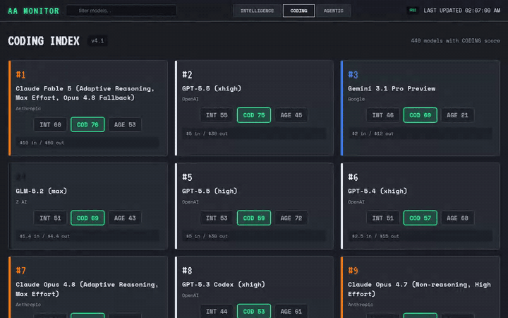
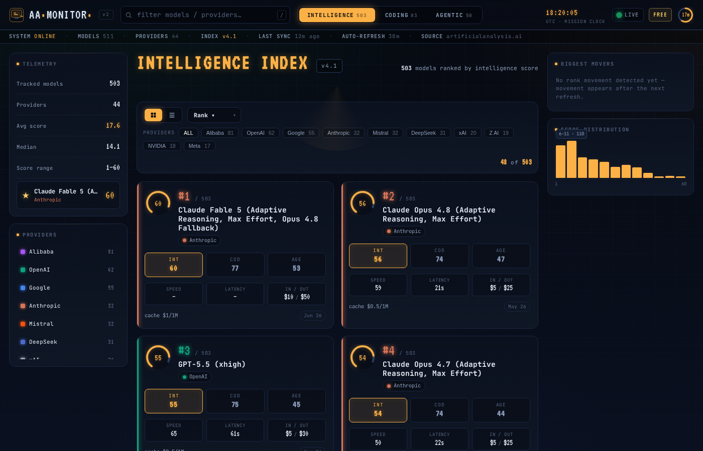
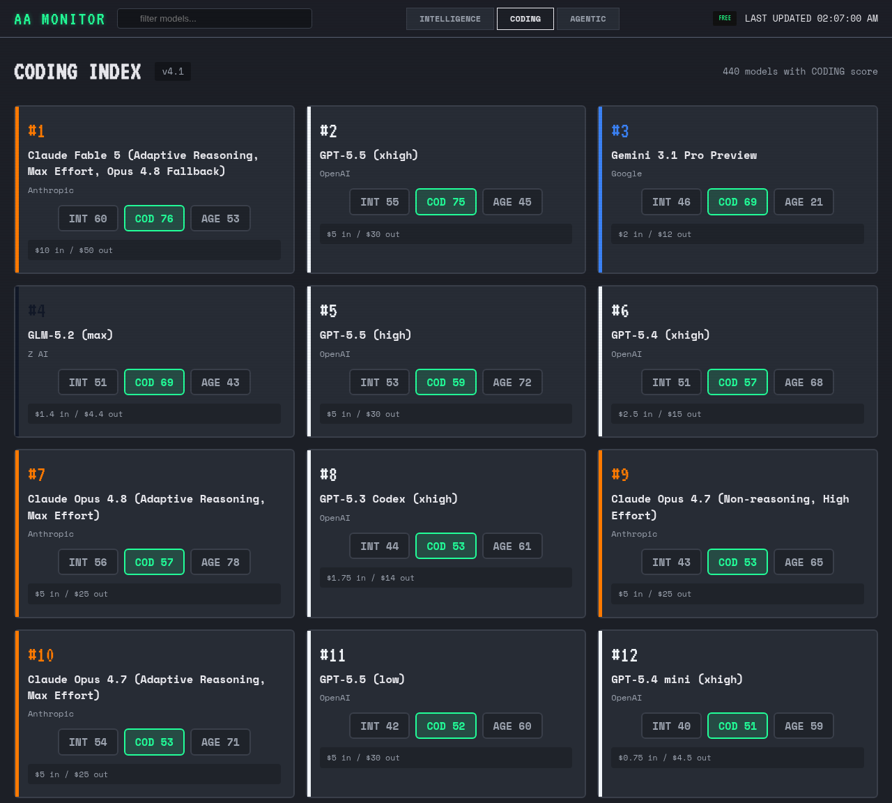

# AA Intelligence Monitor

A beautiful, real-time terminal-style dashboard for [Artificial Analysis](https://artificialanalysis.ai/) model rankings.

Built as a FOSS tool to explore Intelligence, Coding, and Agentic indices with live movement tracking, provider coloring, pricing, and more.

## Demo



## Screenshots

**Intelligence index**



**Coding index**



## Features

- **Live auto-refresh** every 30 minutes
- **Three metric tabs**: Intelligence, Coding, Agentic
- **Per-provider colors** (deterministic palette hashed from creator name)
- **All three scores shown on every card** with current tab highlighted
- **Movement indicators** (▲/▼ rank change vs. the previous refresh, per metric)
- **Pricing information** where available
- **Responsive** (works great on mobile)
- **CRT/phosphor terminal aesthetic** with boot sequence
- **Search** that preserves original global rankings
- **Disk-backed cache** so data survives restarts

## How it works

The server fetches the official Artificial Analysis language models API:

```http
GET https://artificialanalysis.ai/api/v2/language/models/free?page=N
x-api-key: $AA_API_KEY
```

`AA_API_KEY` is read from `process.env.AA_API_KEY`; do not hardcode API keys in
source. The endpoint is paginated, so the server requests pages until the API
reports no more results.

Tab scores come directly from the official API response fields:

- **Intelligence**: `evaluations.artificial_analysis_intelligence_index`
- **Coding**: `evaluations.artificial_analysis_coding_index`
- **Agentic**: `evaluations.artificial_analysis_agentic_index`

The API currently returns `intelligence_index_version` (for example, `4.1`).
Coding and Agentic are Artificial Analysis subsets and are not separately
versioned by this app. The dashboard does not scrape the AA web UI for model or
tab data, and it does not synthesize local/proxy fallback scores such as
`livecodebench` for Coding or `ifbench`/`lcr`/`terminalbench`/`tau` for Agentic.

Pricing and creator metadata are normalized for display. The latest snapshot is
written to `models-cache.json` and reloaded on startup.

## Setup

1. Clone this repo.
2. Export `AA_API_KEY` and optionally override the port:
   ```env
   AA_API_KEY=...
   PORT=1149
   ```
3. Run it (no dependencies to install — uses only Node built-ins):
   ```bash
   node server.js
   ```

The server listens on `process.env.PORT || 1149`. It refreshes immediately on
startup, then every 30 minutes, and serves the most recent cached snapshot while
new refreshes are in progress.

## Validation

Run local checks before committing changes:

```bash
npm test
node -c aa-source.js
node -c server.js
graphify update .
```

## Tech

- Node.js core `http` server (no Express, no third-party deps, no build step)
- Pure HTML/CSS/JS frontend
- Data source: official paginated AA API (`/api/v2/language/models/free`) index fields

## Endpoints

- `GET /` — the dashboard UI
- `GET /api/models` — current enriched snapshot (scores, rank deltas, provider colors)

## License

MIT - do whatever you want with it.

Made with love for the AI community. Feedback welcome.
